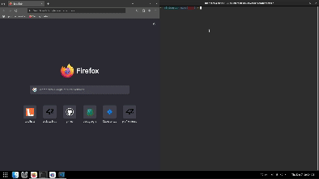

# **webserver**
This project was graded <strong>110/100</strong>.

## 📝 **Authorship**

- [Mario Henriques](https://github.com/maricard18) ([**maricard**](https://profile.intra.42.fr/users/maricard))
- [Bruno Costa](https://github.com/BrunoCostaGH) ([**bsilva-c**](https://profile.intra.42.fr/users/bsilva-c))

## 🧬 **Cloning**

To successfully clone this repository, use this command

```shell
git clone https://github.com/maricard18/42-webserver.git 
```

## 📒 **About**
This project guides you in building a C++ HTTP server, offering a practical understanding of the HTTP protocol. Test your server with real browsers and delve into the fundamentals of networking. Gain insights into web security while creating a functional web server, even if web development isn't your primary focus. Webserv provides a hands-on, educational experience for anyone interested in the core technologies of the internet.


## 🎥 **Demo**

<p align="center">
  
</p>


## 📦 **Compilation**
To compile the webserverer you should run `make` with the configuration file of your choice.
This rule will generate a `webserv` file, which is the zipped version of all the object files.
To launch the executable you should follow this syntax...

```sh
$ ./webserv configuration_file.conf
```

Where `configuration_file.conf` is the name of a file that represents the configuration of the webserver. This file must have a `.conf` extension. You can find example of configuration files in the `config_files` folder.


## 🕹️ **Configuration File rules**

```bash
Server {
    root /absolute/path;
    index index.html; # optional
    autoindex true; # optional, default is false
    server_name _; # optional
    listen 0.0.0.0:8080; # optional IP, default is 0.0.0.0:8080
    client_max_body_size 1M; # optional, default is 1M
    upload_store /path/to/uploaded/files; # optional, default is /uploads
    error_page 404 /relative/path/to/error/page.html; # optional

    location /delete/ {
        # root /path/to/root;
        # index index_file.html;
        # autoindex false/true;
        # allow_methods GET POST DELETE;
    }

    location .py {
        # path to executable
        cgi_pass /absolute/path/to/executable;
    }
}
```

## 💫 **Testing**

This project was tested using self-made tests.
If you wish to access some of these tests, please send us a message on Slack.

---
> Feel free to ask me any questions through Slack (**maricard**). <br>
> GitHub [@maricard18](https://github.com/maricard18) &nbsp;&middot;&nbsp;
> Linkedin [Mario Henriques](https://www.linkedin.com/in/mario18) &nbsp;&middot;&nbsp;
> [42 Porto](https://www.42porto.com/en)
